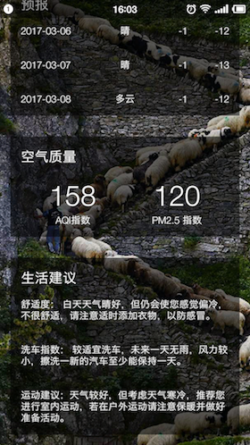
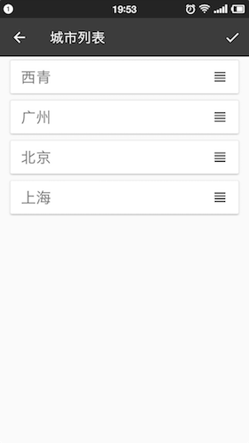
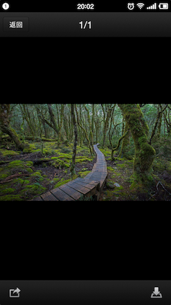

# perfectweather

### 该项目是为了尽量实现一个完整的APP，熟悉多个技术的使用

* 使用OkHttp进行网络请求
* 使用Glide加载图片
* 使用litepal操作数据库
* 使用gson解析json数据
* 使用Material Design效果优化UI简化界面开发
* RecyclerView实现拖动排序，侧滑删除
* ListView实现简单三级列表
* 使用service后台，定时自动更新数据
* 背景充满状态栏，并且解决某些系统DrawerLayout被遮盖问题
* 实现下载图片，支持断点下载，通知栏显示进度
* 隐式Intent调用系统图片查看器打开下载图片

### 应用截图

